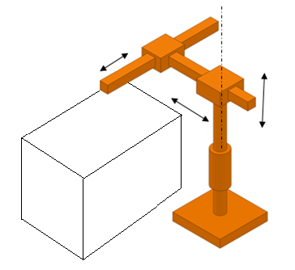
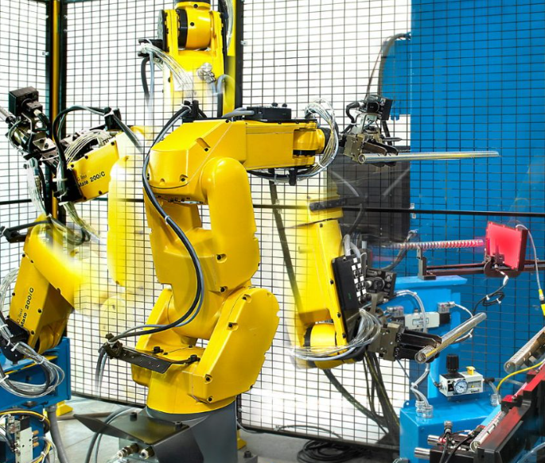

[Home](../index.md)

# Activity 1: Examples of robots by morphology

## Objective:
Investigate and show examples of real life examples of robots with different morphologies.

## Types of robots based on its morphology

### 1.- Cartesian Robot (XYZ or Gantry)

**Morphology and motion**

- Moves along three orthogonal linear axes (X, Y, Z).
- No primary rotational joints.
- Simple kinematics, high rigidity, and high positional accuracy.

**Typical applications**

- CNC machines
- 3D printing
- Pick & place systems
- Material handling

**Real-world examples**

- Xyz Gantry System Gantry Robot Arm Xy Cartesian Robot CNC Gantry

    

- Cartesian Robot JC-3 Series Long Stroke Model

    

---

### 2.- Cylindrical Robot

**Morphology and motion**

Cylindrical work envelope.

Functions by combining:

- 1 rotational joint (base rotation).

- 2 linear motions (radial and vertical).

    

**Typical applications**

- Machine loading/unloading.

- Simple assembly.

- Material transfer.

**Real-world examples**

- Cylindrical Automation Products

    

- Unimate 2000 Series Robot

    

---

### 3.- Polar Robot (Spherical Robot)

**Morphology and motion**

Spherical work envelope.

Combines:

- 2 rotational joints.

- 1 linear joint.

    

**Typical applications**

- Welding.

- Die casting.

- Handling of large components.

**Real-world examples**

- Polar Spherical Robots Midwest Engineered Systems

    

- Cincinnati Milacron T3 Robot

    

---

### 4.- Articulated Robot (Jointed-Arm Robot)

Act almost like if it was a human arm.

**Morphology and motion**

- Composed entirely of rotational joints, this helps to have a similar human arm motion.

- Typically 6 degrees of freedom (6-DOF).

- High flexibility and complex reach.

    

**Typical applications**

- Arc and spot welding.

- Painting.

- Complex assembly.

- Collaborative robotics.

**Real-world examples**

- KUKA KR 210

    

- FANUC M-20iA 20M

    

---

### 5.-SCARA Robot (Selective Compliance Assembly Robot Arm)

**Morphology and motion**

The behaviour of this robot is to be flexible in the horizontal plane (X–Y) and rigid in the vertical direction (Z).

Motion configuration:

- 2 rotational joints in the XY plane.

- 1 linear joint along Z.

- Compliant in XY, rigid in Z.

    

**Typical applications**

- High-speed assemblies.

- Electronics manufacturing.

- Pick & place operations.

**Real-world examples**

- Epson SCARA T6

    

- Omron-i4 SCARA

    

---

## Bibliography

- **L-5|Classifications of Robot|Cartesian|SCARA ROBOT|Jointed arm|Cylindrical|spherical|Parallel|ESE**

    - https://www.youtube.com/watch?v=sZaGhhKbP-w

- **Work envelope of robots**
    - https://electricalelibrary.com/en/2022/01/12/work-envelope-of-robots/